# Lethabo, Your Legal Pal 🦅🇿🇦

**Your rights, in plain English. Howzit, I'm Lethabo!**

[](https://www.python.org/downloads/)
[](https://streamlit.io)
[](https://www.crewai.com/)
[](https://opensource.org/licenses/MIT)

---

### Ever stared at a legal document and felt like you needed a translator? What if that translator was your coolest, smartest friend?

Meet **Lethabo, Your Legal Pal**. We're ditching the confusing jargon and breaking down the South African laws that affect your life—from your rights at a traffic stop to understanding that new job contract.

This interactive chatbot makes understanding complex legal topics simple and conversational. No more confusion. No more intimidation. Just clear, simple answers so you can walk tall, knowing your rights.

 
*(**Note:** You should replace the URL above with a real screenshot of your app!)*

## Key Features

*   **Friendly Chat Interface:** Talk to Lethabo, a friendly AI guide, not a cold search engine.
*   **Deep Research, Simple Answers:** A powerful multi-agent crew works in the background to research SA law and simplify it.
*   **Context-Aware Conversations:** Lethabo remembers the context of your chat to provide relevant follow-up answers.
*   **Vibrant SA-Themed UI:** A user interface that reflects the colors and culture of South Africa.
*   **Scalable Architecture:** Built with a clean, modular structure that's easy to expand.

## System Architecture & Flow

Lethabo uses a two-stage process to provide accurate yet conversational answers.

1.  **The Research Crew (Backend):** When a new topic is entered, a 4-agent CrewAI team performs in-depth research and simplification.
2.  **Lethabo, The Chat Agent (Frontend):** Once the research is complete, Lethabo uses that knowledge base to have a natural, helpful conversation with the user.

Here is a visual representation of the flow:

```mermaid
graph TD
    subgraph "User Interface (Streamlit)"
        A[User enters a legal topic] --> B{App Backend};
        B --> C[Show Researching Spinner];
        F[Chat Interface] --> G{User asks follow-up question};
    end

    subgraph "Stage 1: The Research Crew (Backend Process)"
        C --> D((Start Research Crew));
        D --> R[Researcher Agent];
        R --> S[Simplifier Agent];
        S --> E[Scenario Creator Agent];
        E --> V[Reviewer Agent];
        V --> KB[(Knowledge Base Document)];
    end

    subgraph "Stage 2: The Chat Agent (Lethabo)"
        KB --> F;
        G --> L{Lethabo Chat Agent};
        L -- uses --> KB;
        L -- uses --> LLM[🤖 Gemini LLM];
        L --> H[Generate Friendly Response];
        H --> F;
    end

    style F fill:#007A4D,stroke:#333,stroke-width:2px,color:#fff
    style A fill:#FFB612,stroke:#333,stroke-width:2px,color:#000
```



## Tech Stack

*   **Frontend:** [Streamlit](https://streamlit.io/)
*   **AI Agent Framework:** [CrewAI](https://www.crewai.com/)
*   **Language Model (LLM):** [Google Gemini Pro](https://deepmind.google/technologies/gemini/) (via Vertex AI)
*   **Core Language:** [Python](https://www.python.org/)
*   **Supporting Libraries:**
    *   `langchain-google-vertexai` for LLM integration.
    *   `crewai-tools` for web search capabilities.
    *   `python-dotenv` for environment variable management.

## Project Structure

The project is organized into modular files for easy maintenance and scalability:

```
lethabo_legal_pal/
├── .env                  # Stores secret API keys and project ID
├── README.md             # You are here!
├── requirements.txt      # List of all Python dependencies
├── app.py                # Main Streamlit web application (UI & orchestration)
├── llm_setup.py          # Handles initializing the Gemini LLM
├── agents.py             # Defines all AI agents (Lethabo & the researchers)
├── crew.py               # Assembles the research crew and its tasks
└── style.css             # Contains all the South African-themed styling
```

## 🚀 Setup and Installation

Follow these steps to get Lethabo running on your local machine.

### 1. Prerequisites

*   Python 3.9 or newer.
*   A Google Cloud Project with the **Vertex AI API enabled**.
*   A [Serper API Key](https://serper.dev/) for web search.

### 2. Clone the Repository

```bash
git clone https://github.com/your-username/lethabo-legal-pal.git
cd lethabo-legal-pal
```

### 3. Set Up Your Environment

**A. Create a virtual environment (recommended):**

```bash
python -m venv venv
source venv/bin/activate  # On Windows, use `venv\Scripts\activate`
```

**B. Install dependencies:**

```bash
pip install -r requirements.txt
```

### 4. Configure Environment Variables

**A. Create a `.env` file** in the root directory by copying the example:

```bash
cp .env.example .env  # Or just create a new .env file
```

**B. Edit the `.env` file** with your credentials:

```
SERPER_API_KEY="YourSerperDevKeyHere"
GCP_PROJECT_ID="your-google-cloud-project-id"
```

### 5. Authenticate with Google Cloud

You must authenticate your local environment to use the Vertex AI API. Run the following command in your terminal and follow the browser prompts to log in:

```bash
gcloud auth application-default login
```

## ▶️ Running the Application

Once the setup is complete, run the following command in your terminal:

```bash
streamlit run app.py
```

Your web browser will open with Lethabo ready to chat!

